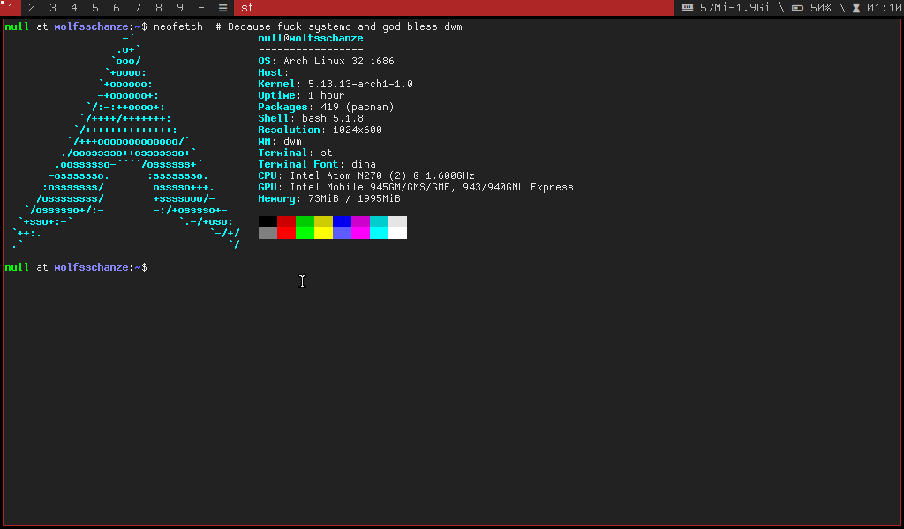
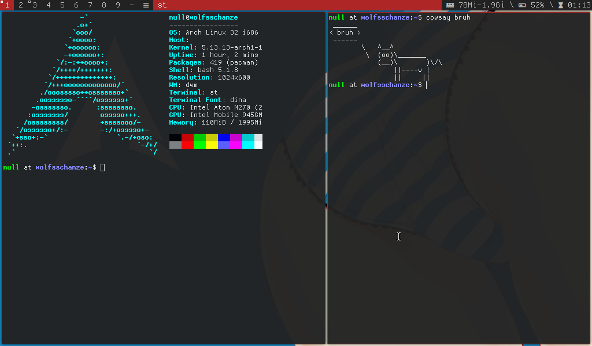
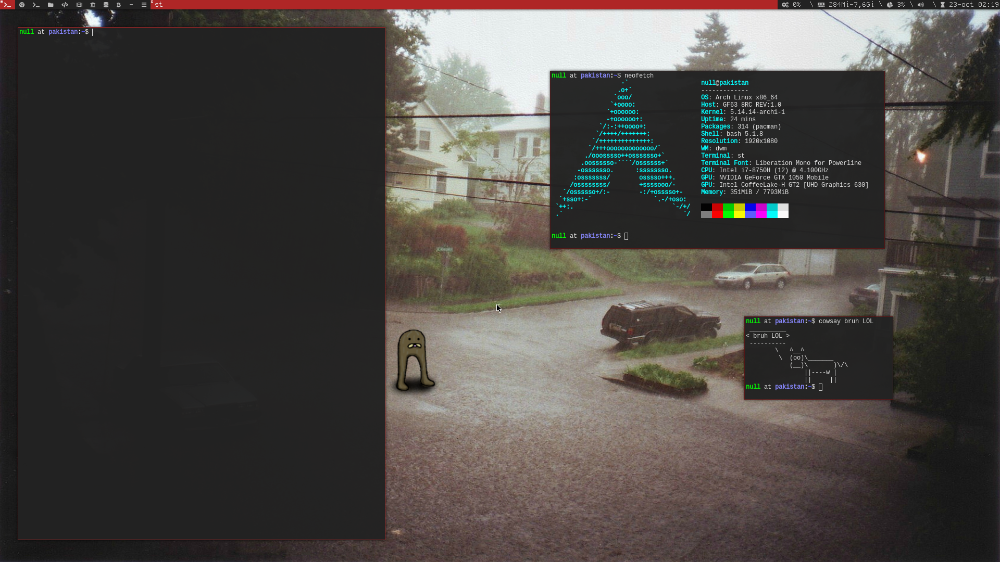

# dwm-lite
**My other dwm config for smaller resolutions.**

This is meant to be used as a replacement for [arch-files](https://github.com/r4v10l1/arch-files/), and you can read the installation guide there.

### Necessary packages
Necessary packages not covered in the main repo.

**dwm 32bits**
```bash
sudo pacman -S xf86-video-intel
```

**Fonts:**
```bash
sudo pacman -S dina-font
```

**Misc.**
While installing it on a Fujitsu T4215 with touchscreen, I needed to install the wacom drivers and add the user to the `tty` and [`uucp`](https://wiki.archlinux.org/title/Users_and_groups#User_groups) group.
```bash
sudo pacman -S xf86-input-wacom  # xf86-video-intel
sudo usermod -aG wheel,audio,video,optical,storage,tty,uucp USERNAME
```

### Todo
- Add [tag-previews](https://dwm.suckless.org/patches/tag-previews/) to dwm.

### Screenshots



